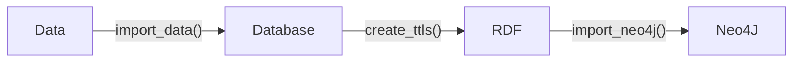

#  ChEBI


***biokb_chebi*** 

- allows to download data from [ChEBI](https://www.ebi.ac.uk/chebi/), import it into relational database (like MySQL, sqlite, POSTGres), create RDF triples (turtles) and import the triples into graph database (Neo4J). 
- is part of the ***biokb*** python package family which allow to combine knowledge graphs from different domain in the context of biology and medicine. All packages implements the following simple pipeline:



All biokb packages share the same structure and usage patterns..

## REST API

***biokb_chebi*** also provides a REST API to access the data stored in the relational database. The API is built using FastAPI and can be easily deployed using Docker. 

### Run locally 

Simplest way to run the API locally for testing purposes:

```bash
pip install biokb_chebi
biokb_chebi run_api
```
http://localhost:8000/docs

Don't use in production! Use Docker or Podman instead.

***User/password***: admin/admin


### Run as Podman container

Build & run with Podman:
```bash
git clone https://github.com/biokb/biokb_chebi.git
cd biokb_chebi
podman build -t biokb_chebi .
podman run -d --name biokb_chebi -p 8000:8000 biokb_chebi
```

http://localhost:8000/docs

stop with:
```bash
podman stop biokb_chebi
```

rerun with:
```bash
podman start biokb_chebi
```

### Run as Docker container

Build & run with Docker:
```bash
git clone https://github.com/biokb/biokb_chebi.git
cd biokb_chebi
docker build -t biokb_chebi .
docker run -d --name biokb_chebi -p 8000:8000 biokb_chebi
```
http://localhost:8000/docs

stop with:
```bash
docker stop biokb_chebi
```

rerun with:
```bash
docker start biokb_chebi
```

### Run with MySQL and Neo4J as podman-compose services

```bash
git clone https://github.com/biokb/biokb_chebi.git
cd biokb_chebi 
podman-compose -f docker-compose.db_neo.yml --env-file .env_template up -d
podman-compose --env-file .env_template up -d
```

In production copy .env_template to .env and use secure passwords (and skip `--env-file .env_template` in the last command)!

```bash
podman-compose -f docker-compose.db_neo.yml up -d
podman-compose up -d
```

http://localhost:8001/docs


## CLI

```
pip install biokb_chebi
biokb_chebi --help
```
import data:
```
biokb_chebi import-data
```
-> SQLite database in `~/.biokb/biokb.db`
create turtles:
```
biokb_chebi create-ttls
```
Start Neo4J ...
```bash
podman run --rm --name biokb-neo4j-test -p7474:7474 -p7687:7687 -e NEO4J_AUTH=neo4j/neo4j_password neo4j:latest
```
... and import into Neo4J:
```
biokb_chebi import-neo4j
```

http://localhost:7474  (user/password: neo4j/neo4j_password)
