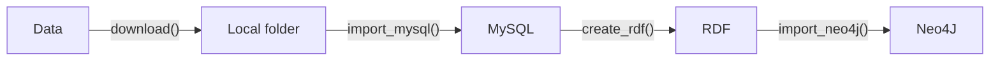
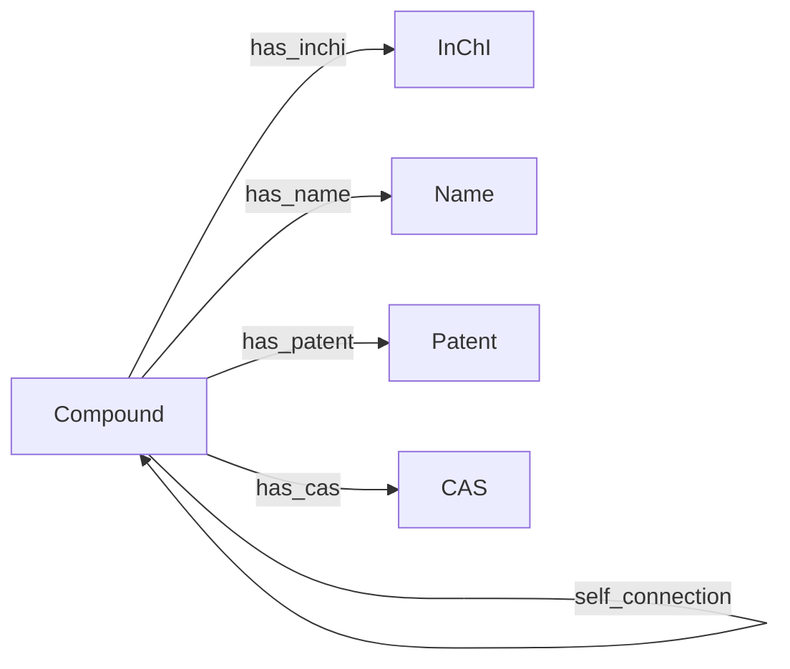
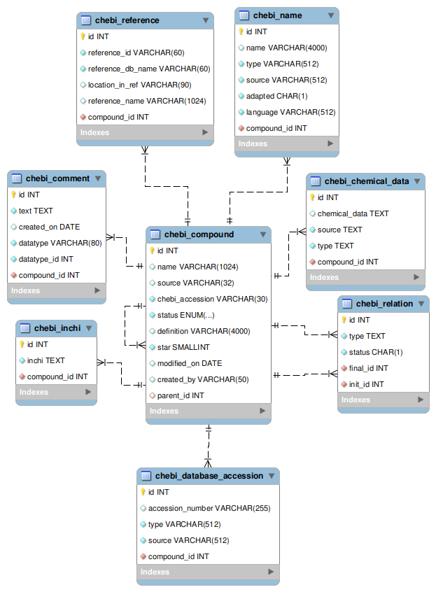

#  ChEBI

 

<h2>What is it?</h2>

***biokb_chebi*** allows to download data from [ChEBI](https://www.ebi.ac.uk/chebi/), import it into relational database (MySQL), create RDF triples (turtles) and import the triples into graph database (Neo4J). ***biokb_chebi*** is part of the ***biokb*** python package family which allow to combine knowledge graphs from different domain in the context of biology and medicine. All packages implements the following simple pipeline:



<h2>Table of content</h2>

1. [Schemas](#schemas)
   1. [Graph model](#graph-model)
   2. [Database ER model](#database-er-model)
2. [For the impatient](#for-the-impatient)
3. [Install](#install)
4. [Background on ChEBI](#background-on-chebi)
   1. [What is ChEBI?](#what-is-chebi)
   2. [The ChEBI star rating system](#the-chebi-star-rating-system)
   3. [Meaning of status in compound table](#meaning-of-status-in-compound-table)
5. [Comment on test data](#comment-on-test-data)
6. [Data imported from ChEBI](#data-imported-from-chebi)
7. [Links](#links)
8. [ToDos:](#todos)

---

## Schemas

### Graph model



**Fig.1:** Simplified Neo4J model (only node and edge labels are shown). ***self_connection*** in the schema below could be ( has_functional_parent, has_parent_hydride, has_part, has_patent, has_role, is_a, is_conjugate_acid_of, is_conjugate_base_of, is_enantiomer_of, is_substituent_group_from, is_tautomer_of)

### Database ER model



**Fig.2:** MySQL ER model create with [MySQL workbench](https://www.mysql.com/products/workbench/). Structure table will be implemented in version 1.0.

## For the impatient

copy the **docker-compose.yml** from https://github.com/SCAI-BIO/biokb_chebi/ into your local folder

```bash
podman-compose up -d
pip install biokb_chebi
biokb_chebi complete-import -mp biokb_chebi_password -np neo4j_password -mo 3307
```

Login ...
1. [phpMyAdmin](http://localhost:8180) with *biokb_chebi_user/biokb_chebi_password*
2. [Neo4j](http://localhost:7475) with **


## Install

At least 8Gb for memory and 5 Gb of free disk space (for MySQL and Neo4j) are recommended.

Requirements:
1. Python >=3.9 python
2. MySQL
3. Optional Neo4J if you want to import into Neo4J

Because [biokb_brenda](https://github.com/SCAI-BIO/biokb_brenda) is still private on GitHub:

```bash
git clone git@github.com:SCAI-BIO/biokb_brenda.git
cd biokb_brenda
python3 -m venv .venv
source .venv/bin/activate
pip install .
```
If you are not already running MySQL and Neo4J server please check the next chapter "Using containers".

## Background on ChEBI

### What is ChEBI?

[ChEBI](https://www.ebi.ac.uk/chebi/) is a freely available database that provides comprehensive and meticulously curated information about molecular entities focusing on chemical entities of biological interest. Maintained by the European Bioinformatics Institute (EBI), ChEBI is one of the most cited and valuable databases in bioinformatics and includes chemical data, nomenclature, and ontology, making it a valuable resource for researchers in chemistry, biology, and related fields.


### The ChEBI star rating system

#TODO: Explain why this could be important

* ★ Preliminary data gets 1 star and is not normally displayed on the ChEBI website
* ★★ Data from externally curated sources (e.g. imported from KEGG) but not yet checked by ChEBI gets 2 stars and appears “as is” on the ChEBI website
* ★★★ After an entry has been updated with additional links, cross-references, etc, and checked by a member of ChEBI curation team, it is upgraded to 3 stars

### Meaning of status in compound table

In the table we can find ("C", "D", "E", "O", "S") as status.

According to the [README.txt from ChEBI](http://ftp.ebi.ac.uk/pub/databases/chebi/README.txt) the status refer to has the following definitions:
- **C** - Checked by one of our curators and released to the public domain.
- **E** - Exists but not been checked by one of our curators.
- **O** - Compound was made obsolete due to the merger of compounds.

From the [web application](https://www.ebi.ac.uk/chebi/init.do) we can conclude:

- **D** - Entity has been deleted
- **S** - Annotated by a third party.

## Comment on test data

[Test data](tests/data) try to cover all different types and sources like in the original data. The content makes perhaps no sense.

## Data imported from ChEBI

#TODO: Explain here why used some filters

## Links
* [Tab delimited flat files](http://ftp.ebi.ac.uk/pub/databases/chebi/Flat_file_tab_delimited/)
* [README.txt from ChEBI](http://ftp.ebi.ac.uk/pub/databases/chebi/README.txt)
* [ChEBI Annotation manual](https://docs.google.com/document/d/1EZHaOEl-iPZPbqD_GRyIetDoA4U8U2SPr9Qk6RKVRc0/edit)


## ToDos:

#TODO: Synchronize code structure Brenda, ChEBI and UniProt