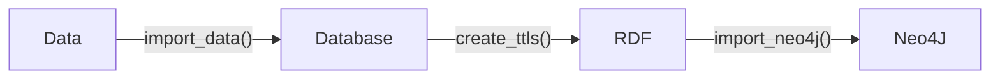

#  ChEBI

***biokb_chebi*** 

- allows to download data from [ChEBI](https://www.ebi.ac.uk/chebi/), import it into relational database (like MySQL, sqlite, POSTGres), create RDF triples (turtles) and import the triples into graph database (Neo4J). 
- is part of the ***biokb*** python package family which allow to combine knowledge graphs from different domain in the context of biology and medicine. All packages implements the following simple pipeline:

